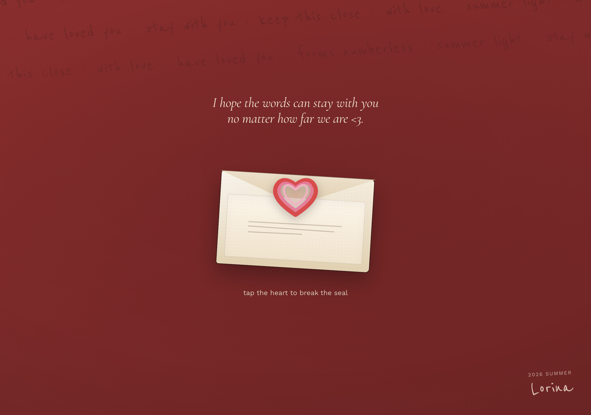
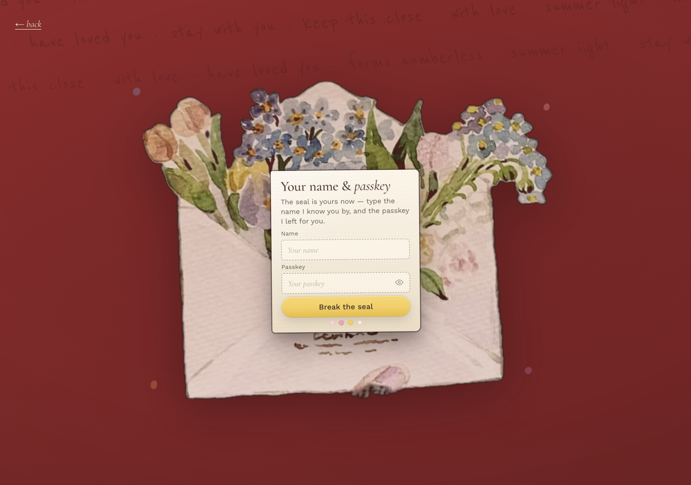
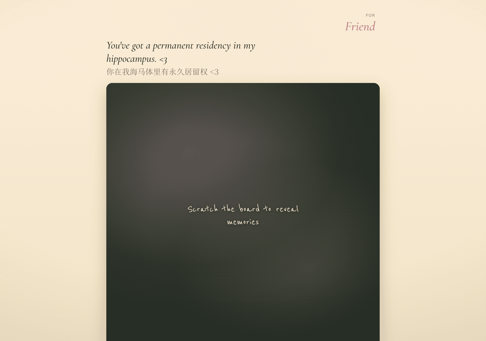
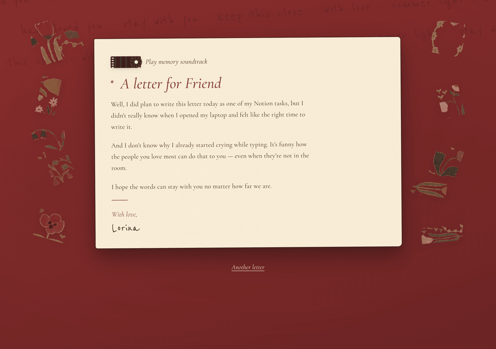

# Letters 


A vintage, soft-editorial letter site — sealed, intimate, handwritten. Each friend opens their own letter with a private passkey. Vanilla HTML/CSS/JS, no build step.

**Live:** [letter-from-lorina.vercel.app](https://letter-from-lorina.vercel.app)

---

## ✉️ Overview

**Letters from Lorina** is a small, private mail of gratitude — sealed for friends and family, opened only by the people who know their passkey. Each person gets a scratchboard of memories, a letter written just for them, and an optional soundtrack.

I built it during graduation season — friends scattering across the world, leaving my parents for a master's abroad, and not always knowing when we'd see each other again. Letters have always been how I reach the deepest parts of human connection: time to reflect, say thank you, and express love without rushing.

> *I hope the words can stay with you no matter how far we are.*

Design direction adapted from [beautiful-html-templates / soft-editorial](https://github.com/zarazhangrui/beautiful-html-templates/tree/main/templates/soft-editorial), pushed warmer and more romantic (cream paper, warm ink, blush / rose / lemon).

---

## 🖼 Preview

Screenshots live in [`docs/screenshots/`](docs/screenshots/). Drop or replace PNGs there — filenames below.

| Page | Purpose | Screenshot |
|------|---------|------------|
| **1 — Sealed letter** | Tap the heart to break the wax seal |  |
| **2 — Name & passkey** | Private login — name + passkey unlock the letter |  |
| **3 — Memories** | Scratchboard collage — reveal photos before the letter |  |
| **4 — Letter + music** | Full letter body, florals, optional soundtrack |  |

<details>
<summary>📷 Capture or refresh screenshots locally</summary>

```bash
python3 -m http.server 8765 &
node scripts/capture_screenshots.mjs
```

Requires [Playwright](https://playwright.dev/) (`npx playwright install chromium` once). Outputs to `docs/screenshots/`.

</details>

---

## 🔐 Passkey & Chinese input

The passkey field supports **both paste and IME typing** (Pinyin and other composition-based keyboards).

Browsers treat `type="password"` inputs differently during IME composition — composed characters (e.g. 小小钵钵鸡) often never commit into the field, while **paste bypasses the IME** and worked fine. That made pasted Chinese passkeys unlock but typed ones fail silently.

**Fix:** passkey uses `type="text"` with CSS masking (`-webkit-text-security: disc`) so dots still hide the value visually. On submit, name and passkey are trimmed and normalized with **Unicode NFC** so typed and pasted input compare identically to the stored passkey.

Do not revert the passkey input to `type="password"` without re-testing Chinese IME in Chrome and Safari.

---

## 🗄 Reference database

Letter content, passkeys, and media metadata live in **Supabase Postgres** (not in this repo). The schema below is the current production shape — modified from the original soft-editorial template to support per-person letters, private media, and bcrypt passkeys.

Access is **Edge Function only** (`get-letter` → `get_letter_for()` RPC). RLS is enabled on all tables with **no policies** for `anon` / `authenticated`; the function uses the service role key.

Storage: private bucket **`letter-media`** — signed URLs (1 h TTL) returned at login.

<details>
<summary><strong>Full schema — tables, fields, types, purpose</strong></summary>

### `public.friends`

One row per recipient. Login matches `username` (case-insensitive) or any entry in `aliases`.

| Column | Type | Purpose |
|--------|------|---------|
| `id` | `uuid` PK | Internal friend id |
| `username` | `text` UNIQUE | Primary login name (e.g. `adi`, `yangran`) |
| `display_name` | `text` | Shown on memories board (e.g. `Adi`) |
| `display_name_zh` | `text` | Optional Chinese display name |
| `passkey_hash` | `text` | bcrypt hash via `hash_passkey()` — never store plaintext in prod |
| `seal` | `text` | Wax-seal monogram on Page 1 (e.g. `L&M`) |
| `aliases` | `text[]` | Alternate login names (e.g. `杨冉` for yangran) |
| `avatar` | `text` | Optional avatar path (reserved) |
| `is_active` | `boolean` | Soft-disable login when `false` |
| `created_at` / `updated_at` | `timestamptz` | Audit timestamps |

### `public.letters`

One letter per friend (latest row wins in `get_letter_for`). Body text in `paragraphs` jsonb array.

| Column | Type | Purpose |
|--------|------|---------|
| `id` | `uuid` PK | Letter id |
| `friend_id` | `uuid` FK → `friends` | Owner |
| `slug` | `text` UNIQUE | Stable slug (e.g. `adi-2026`) |
| `title` | `text` | Letter heading (empty string = hidden in UI) |
| `title_zh` | `text` | Optional Chinese title |
| `greeting` | `text` | Salutation line (e.g. `For Adi`) |
| `greeting_zh` | `text` | Optional Chinese greeting |
| `opener` | `text` | Opening paragraph prepended to body when set |
| `paragraphs` | `jsonb` | `["para one", "para two", …]` — main letter body |
| `blocks` | `jsonb` | Future rich blocks `[{type,…}]` |
| `scratchboard` | `jsonb` | Board config `{image, alt, aspect, background, caption_en, caption_zh}` |
| `memories` | `jsonb` | Optional collage layout (reserved) |
| `music` / `soundtrack` | `jsonb` | Per-letter audio overrides (reserved) |
| `gallery` | `jsonb` | Extra gallery config (reserved) |
| `copy` | `jsonb` | Per-letter UI strings (reserved) |
| `cta` / `extras` | `jsonb` | CTA / misc (reserved) |
| `signoff` | `text` | Closing line (default `With love,`) |
| `signoff_zh` | `text` | Optional Chinese signoff |
| `sign_name` | `text` | Signature name (default `Lorina`) |
| `is_locked` | `boolean` | When `true`, login returns friendly locked message |
| `unlock_date` | `timestamptz` | Optional time-based lock |
| `created_at` / `updated_at` | `timestamptz` | Audit timestamps |

### `public.letter_media`

Private storage paths — **not** public URLs. Edge Function signs each path at login.

| Column | Type | Purpose |
|--------|------|---------|
| `id` | `uuid` PK | Media row id |
| `letter_id` | `uuid` FK → `letters` | Parent letter |
| `media_key` | `text` | Stable key (e.g. `scratchboard`, `photo-01`) — unique per letter |
| `type` | `text` | `image` \| `video` \| `audio` |
| `storage_path` | `text` | Path in `letter-media` bucket (e.g. `adi/board/scratchboard.webp`) |
| `filename` | `text` | Original filename (optional) |
| `caption` | `text` | Display caption (optional) |
| `sort_order` | `int` | Collage / playlist ordering |
| `metadata` | `jsonb` | Extra attrs (dimensions, mime, etc.) |
| `created_at` | `timestamptz` | Created timestamp |

### `public.app_settings`

Global UI copy and soundtrack metadata (key-value jsonb).

| Column | Type | Purpose |
|--------|------|---------|
| `key` | `text` PK | Setting name (e.g. `copy`, `soundtrack`, `meta`) |
| `value` | `jsonb` | Setting payload |
| `updated_at` | `timestamptz` | Last update |

Pre-login chrome strings also ship in repo `data/letters.json` for offline Page 1–2 copy.

### Functions

| Function | Purpose |
|----------|---------|
| `hash_passkey(plain text)` | bcrypt hash for seeding / rotating passkeys |
| `get_letter_for(p_name, p_passkey)` | Verify login; return friend, letter, media, settings jsonb |

### Edge Function `get-letter`

`POST` with `{ "name", "passkey" }` → RPC → attach signed URLs → JSON response. Rate limit: 10 req/min/IP. Wrong name/passkey return identical opaque error.

</details>

<details>
<summary><strong>Supabase setup — SQL run order</strong></summary>

Run in **Supabase → SQL Editor**:

| File | Purpose |
|------|---------|
| `supabase/00_preflight.sql` | Read-only — check existing tables |
| `supabase/01_schema.sql` | Core tables, RLS, functions |
| `supabase/04_app_settings.sql` | `app_settings` if missing |
| `supabase/05_letters_extra_columns.sql` | Extra letter/friend columns |
| `supabase/02_seed.sql` | Friend shells + media rows |
| `supabase/03_seed_letters.sql` | Letter bodies (generated; gitignored locally) |
| `supabase/99_reset.sql` | Drop everything (destructive) |

Upload media:

```bash
# .env locally (gitignored): SUPABASE_URL, SUPABASE_SERVICE_ROLE_KEY
python3 scripts/upload_letter_media.py --person adi
```

Per-friend letter SQL backups: `supabase/letters/<name>.sql` (gitignored — run manually in SQL Editor).

</details>

---

## 🚀 Setup / run locally

```bash
git clone https://github.com/Coconut101-beep/Letter.git
cd Letter
python3 -m http.server 8765
```

Open [http://127.0.0.1:8765/index.html](http://127.0.0.1:8765/index.html)

Login requires Supabase — anon key and project URL are in `assets/js/app.js`. Letter bodies are **not** in the static repo.

**Deploy:** push to `main` → Vercel rebuilds automatically.

---

## 📁 Project structure

```
Letter/
├── index.html                 # Single-page app — all four views
├── data/
│   └── letters.json           # Pre-login UI copy (no passkeys or letter bodies)
├── assets/
│   ├── css/style.css          # Design tokens, layout, motion, dark mode
│   ├── js/app.js              # Views, Supabase login, letter/memories builders
│   ├── js/scratch-board.js    # Canvas scratch-off interaction (Page 3)
│   ├── img/                   # Florals, envelope, open-letter art
│   └── audio/                 # Shared soundtrack file (also in Storage)
├── docs/
│   └── screenshots/           # README preview images (01-home.png …)
├── scripts/
│   ├── upload_letter_media.py # Upload scratchboards to Supabase Storage
│   ├── generate_supabase_seed.py
│   └── capture_screenshots.mjs # Playwright screenshot helper
└── supabase/
    ├── 01_schema.sql          # Postgres schema + RPC
    ├── 02_seed.sql …          # Seeds and migrations
    ├── letters/*.sql          # Per-friend letter backups (gitignored)
    └── functions/get-letter/  # Edge Function (Deno)
```

---

## 🛠 Tech stack

| Layer | Choice |
|-------|--------|
| Front end | HTML5, CSS3 (custom properties), vanilla JS |
| Hosting | Vercel (static) |
| Backend | Supabase Postgres + Edge Functions |
| Auth | Passkey per friend (bcrypt in DB) — no user accounts |
| Media | Supabase Storage (`letter-media`, signed URLs) |
| Fonts | Cormorant Garamond, Work Sans, Reenie Beanie, Noto Serif SC |

---

## 📜 Flow

Single `index.html` with JS view switching:

1. **Sealed letter** — star-heart unlock over a vintage envelope
2. **Name + passkey** — cream card form (IME-safe passkey field)
3. **Memories** — scratchboard collage
4. **Letter + music** — letter body, florals, soundtrack toggle

---

*With love, Lorina*
